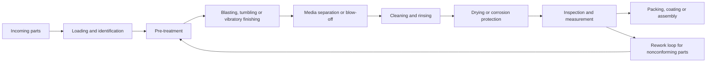
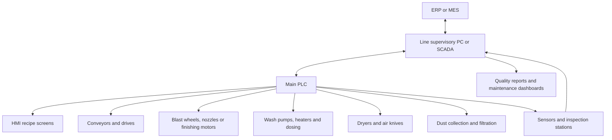
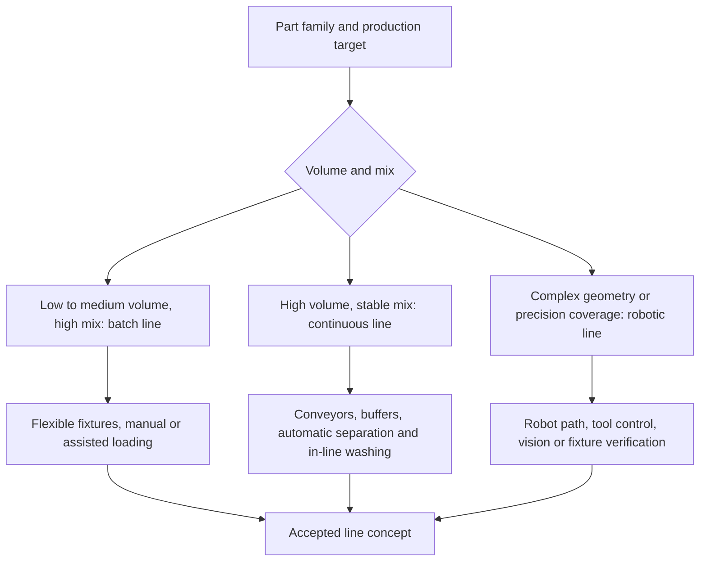

# Surface Finishing Lines: Complete Guide to Automated Systems, Equipment Integration and Process Design

A surface finishing line is an integrated production system that changes, cleans, prepares or verifies the surface condition of manufactured parts. In an industrial plant, the line may remove scale from steel fabrications, clean sand from castings, deburr machined parts, create a controlled roughness profile before coating, polish medical components, or prepare aerospace hardware for downstream inspection and assembly. The line is not simply a group of machines placed in a row. It is a process-engineered system made of equipment, media, water chemistry, dust collection, material handling, controls, quality checks and maintenance access.

For factory owners and production managers, surface finishing lines often sit at the point where quality, throughput and labor cost collide. A machining center may produce accurate geometry, but burrs, scale, oxides, oil and inconsistent roughness can still make the part unsuitable for coating, bonding, sealing or final shipment. Manual finishing can solve some of these problems, but it usually does so with variable quality, high labor intensity, ergonomic risk and limited traceability. A well-designed automated finishing line turns surface treatment into a controlled manufacturing process.

Integrated systems matter because surface finishing results are not created by one machine alone. A shot blasting machine can produce the required surface profile, but if the part enters with heavy oil contamination, the abrasive and dust collector will be loaded with residue. A vibratory finishing system can create a consistent edge break, but if the washer does not remove compound and media fines, parts may fail cleanliness requirements. A drying tunnel may be sized for nominal throughput, but if baskets are overloaded or part geometry traps water, corrosion can appear after packaging. These are system problems, and they require system design.

This pillar page explains how complete surface finishing production lines are specified, integrated and justified commercially. It covers typical process flow, key equipment, automation architecture, line configurations, performance metrics, industry applications, ROI analysis and custom line design criteria. It is written for buyers who need more than a machine quote. If you are planning a new finishing cell, replacing manual finishing, upgrading a batch process into a continuous line, or building capacity for aerospace, automotive, foundry, metal fabrication or medical device production, this guide will help you define the right technical and commercial questions before requesting a proposal.

**Commercial CTA:** If you already know your part size range, annual volume, material, current process and target surface requirement, request a surface finishing line concept study. A good supplier should be able to convert that information into a recommended process route, preliminary layout, utility estimate, automation concept and budgetary payback model.

## Table of Contents

1. [What Is a Surface Finishing Line?](#what-is-a-surface-finishing-line)
2. [Typical Process Flow](#typical-process-flow)
3. [Key Equipment in Finishing Lines](#key-equipment-in-finishing-lines)
4. [Automation and Control](#automation-and-control)
5. [Performance Metrics](#performance-metrics)
6. [Line Configurations](#line-configurations)
7. [Industry Applications](#industry-applications)
8. [ROI and Cost Analysis](#roi-and-cost-analysis)
9. [Custom Line Design](#custom-line-design)
10. [Internal Linking and Buyer Resources](#internal-linking-and-buyer-resources)

## What Is a Surface Finishing Line?

A surface finishing line is a coordinated sequence of machines and process stations designed to produce a defined surface condition at a defined production rate. The line may be fully automated, semi-automatic or batch-based. It may include shot blasting, air blasting, vibratory finishing, barrel tumbling, centrifugal finishing, washing, rinsing, drying, cooling, inspection, marking and packaging. In some plants, the finishing line is directly connected to casting, forging, machining, heat treatment, welding, coating or assembly operations.

The objective is not only to make a part look better. Surface finishing affects measurable and commercial outcomes:

- Coating adhesion and paint performance
- Edge condition and burr removal
- Surface roughness values such as Ra and Rz
- Cleanliness before assembly, plating, passivation or coating
- Corrosion risk after washing and storage
- Fatigue performance when peening or controlled impact processes are included
- Dimensional stability when aggressive finishing processes are applied
- Operator safety, ergonomics and exposure control
- Labor cost per good part
- Scrap, rework and customer complaints

In a complete production line, each station must protect the performance of the next station. Pretreatment prepares the part for the main finishing action. The main finishing process creates the surface effect. Cleaning removes residual media, fines, compound, oil, dust and process chemistry. Drying prevents corrosion, water spotting and packaging issues. Inspection verifies that the line is still producing the intended result. The control system records process settings and alerts operators when the process is drifting.

### Why Integrated Systems Matter

Many plants begin with stand-alone finishing equipment because it is easier to purchase one machine at a time. A manual blast cabinet is bought to clean weldments. A vibratory bowl is added for small machined parts. A washer is added later because customers complain about residue. Operators move parts by carts, baskets or forklifts. The process works until volume increases, labor becomes scarce, or a customer requires tighter quality evidence.

An integrated surface finishing line solves a different business problem. It connects the process steps around takt time, part flow, quality requirements and operating cost. The line is engineered around real part geometry, production mix, lot size, changeover frequency, media consumption, chemical management, dust collection, floor space, utilities and operator interaction. Instead of asking whether one machine can process a part, the design asks whether the entire system can produce good parts every shift at the required cost.

Integration creates value in several ways:

- **Repeatability:** Recipes, controlled dwell times, media flow, wheel speed, water temperature and conveyor speed reduce operator-to-operator variation.
- **Throughput:** Conveyors, automated loading, accumulation buffers and synchronized cycle times prevent machines from starving or blocking each other.
- **Quality control:** Inspection points and data logging make it easier to detect drift before parts reach the customer.
- **Lower labor intensity:** Operators supervise flow, replenish consumables and handle exceptions instead of manually blasting, washing and drying each part.
- **Safer operation:** Enclosures, guarding, interlocks, dust collection and ergonomic loading reduce exposure to dust, noise, heat, repetitive motion and heavy lifting.
- **Lower total cost:** Better first-pass yield, less rework, controlled consumable usage and higher uptime often matter more than the initial equipment price.

For buyers, the key lesson is simple: surface finishing lines should be purchased as production systems, not as isolated machines. The best commercial proposal is not the cheapest machine list. It is the design that meets the surface specification, production volume and cost-per-part target with an acceptable investment risk.

## Typical Process Flow

Most automated surface finishing lines follow a common process logic: prepare the part, perform the finishing action, remove residue, dry or stabilize the part, then inspect and transfer it to the next operation. The exact equipment depends on material, geometry, surface requirement and production volume, but the overall sequence is similar across many industries.



The flow diagram looks straightforward, but the engineering challenge is hidden in the transitions. Parts may need to be fixtured differently for blasting than for washing. Heavy castings may require a roller conveyor, while light machined parts may need a belt, basket, vibratory conveyor or robotic gripper. Parts with blind holes may trap media and water. Mixed production may require recipe control, barcode identification and automated diverters. Every transfer point should be designed around the real physical behavior of the parts, not an idealized process chart.

### 1. Pre-treatment

Pre-treatment prepares the part for the main finishing process. It can include sorting, weighing, loading, degreasing, alkaline cleaning, masking, pre-rinsing, thermal conditioning, scale loosening, oil removal, chip removal or basic dimensional checks. In blasting lines, pre-treatment may be needed to prevent oil from contaminating abrasive media. In vibratory finishing lines, chips and heavy cutting oil can reduce compound performance and increase sludge. In medical or aerospace work, pre-treatment may also protect traceability by ensuring that mixed material lots do not enter the same process batch.

Common pre-treatment questions include:

- What contaminants are present on incoming parts?
- Are parts wet, oily, scaled, rusty, dusty or covered in machining chips?
- Will the contaminant damage abrasive, media, pumps, filters or dust collectors?
- Does the part need masking to protect threads, sealing surfaces or machined datums?
- Is part orientation important for the next process station?
- Can the line accept mixed part families, or should parts be grouped by geometry and material?

Pre-treatment is often under-specified during early quotations, but it can be the reason a line succeeds or fails. A finishing machine designed around clean sample parts may underperform when production parts arrive with heat treat scale, sticky oil, casting sand or packed chips. A supplier should ask for representative samples, not only drawings.

### 2. Blasting or Finishing

The central process station creates the desired surface effect. The most common choices are shot blasting, air blasting, vibratory finishing, barrel tumbling, centrifugal disc finishing, centrifugal barrel finishing, brushing, polishing or robotic abrasive finishing. The correct technology depends on the type of material removal or surface change required.

Shot blasting machines use high-velocity metallic or mineral media to clean, descale, profile, deflash or strengthen surfaces. Wheel blast machines are common for high-volume parts because the blast wheel throws abrasive efficiently. Air blast systems are useful for precision work, complex geometry, cabinets and robotic applications. See the related resource: [Shot Blasting Machines](/shot-blasting-machines/).

Vibratory finishing systems use a container, vibration energy, media and compound to deburr, radius, smooth, clean or polish parts. They are strong choices for small to medium parts that can contact media without damage. They can be configured as batch bowls, rectangular tubs, continuous machines or automated work cells. See [Vibratory Finishing Equipment](/vibratory-finishing-equipment/).

Tumbling machines rotate parts and media in a barrel or high-energy chamber. They are often used for deburring, edge breaking, descaling and mass finishing when parts can tolerate part-on-part contact. For a detailed comparison, see the [Tumbling Machine Guide](/tumbling-machine-guide/).

The main finishing process should be defined by a process window, not by a machine name. A process window includes cycle time, media type, media size, compound concentration, wheel speed, nozzle pressure, part load, batch weight, temperature, water flow, separation method and acceptable variation. Without this window, it is difficult to guarantee repeatability or calculate cost per part.

### 3. Media Separation, Blow-Off and Carryover Control

Many finishing lines need a transition station between the main finishing action and washing. Abrasive, ceramic media, plastic media, steel shot, dust, scale, chips and compound can travel with the part. Carryover increases operating cost and can create quality defects downstream.

Typical solutions include:

- Vibratory screens or separation decks for media and parts
- Magnetic separators for steel media or ferrous contamination
- Air knives and blow-off stations for chips, water or abrasive
- Rotary screens, drum separators or mesh belts
- Part rotation to empty pockets and blind features
- Media return conveyors and surge hoppers
- Dust extraction around transfer points

Carryover control is especially important in continuous lines. A small amount of media lost per part becomes a large cost at high volume. It can also damage washers, pumps, seals and downstream conveyors. If parts include threaded holes, oil galleries, ribs, cavities or undercuts, the line should include a plan for dislodging trapped media.

### 4. Cleaning

Cleaning removes process residue and prepares the part for drying, coating, assembly or inspection. The cleaning station may be a spray washer, immersion washer, ultrasonic tank, rotary drum washer, belt washer, cabinet washer or multi-stage wash/rinse system. Critical variables include spray pressure, nozzle arrangement, temperature, detergent type, filtration, oil skimming, pH, conductivity, dwell time and part orientation.

Cleaning quality should be tied to the next operation. A part going to powder coating may need a different cleanliness and surface chemistry than a part going directly into a sealed hydraulic assembly. A medical device component may require very low particulate and residue levels. A foundry casting may need rugged sand removal, while an aerospace bracket may need controlled water quality and traceable process settings.

Important cleaning design questions include:

- What residue must be removed: abrasive, oil, compound, dust, oxides, salts, chips or polishing paste?
- Is the goal cosmetic cleanliness, coating readiness, assembly cleanliness or regulated cleanliness?
- Does the line need one wash stage or multiple wash and rinse stages?
- Should the final rinse use deionized water?
- How will water chemistry be monitored?
- How will oil, sludge and fines be removed from the bath?
- What happens when a nozzle plugs or pressure drops?

For high-volume automated systems, cleaning is not a utility add-on. It is a controlled process station that should be specified with the same seriousness as the blasting or finishing machine.

### 5. Drying

Drying prevents corrosion, spotting, trapped moisture, packaging defects and contamination during storage. Common drying methods include hot air tunnels, centrifugal dryers, vibratory dryers with drying media, heated blow-off, vacuum drying, spin drying and air knife systems. The correct method depends on part geometry, material, surface finish, throughput and allowable handling.

Drying is simple only for simple parts. Flat parts on a conveyor may dry easily. Parts with threaded holes, internal channels, nested cavities or porous surfaces require more attention. If water remains in blind holes, corrosion or residue can appear after the parts are packed. If the dryer runs too hot, it can stain parts, degrade temporary corrosion protection, damage plastic components or create unnecessary energy cost.

Drying should be validated with real part loads, not only empty conveyor tests. A dryer that works at low density may fail when baskets are filled to production weight. For corrosion-sensitive parts, the line may also include rust inhibitor, passivation, controlled packaging or humidity-controlled storage after drying.

### 6. Inspection

Inspection verifies that the surface finishing line is producing acceptable parts. It may include visual checks, surface roughness measurement, dust tape tests, coating adhesion tests, dimensional checks, burr checks, cleanliness measurement, weight checks, color checks, edge radius checks, corrosion inspection or automated vision.

The best inspection strategy balances risk and speed. Not every part needs full measurement, but every high-volume line needs a plan for proving process stability. This can include first-off approval, hourly checks, statistical process control, recipe verification, automated alarms and periodic lab testing. See [Surface Roughness Measurement](/surface-roughness-measurement/) for a deeper guide to Ra, Rz, sampling direction and measurement pitfalls.

Inspection should be placed where it can prevent waste. If a line has multiple expensive downstream operations, early detection saves cost. If parts are blasted before coating, roughness checks before the coating booth can prevent entire batches from being painted over a bad surface profile. If parts are washed before medical assembly, cleanliness verification should be integrated into the quality plan rather than treated as a final surprise.

## Key Equipment in Finishing Lines

A complete finishing line may include many types of equipment. The right combination depends on whether the priority is cleaning, descaling, deburring, surface profiling, polishing, cosmetic finishing, peening, coating preparation or precision contamination control. The table below summarizes the major equipment categories and the decisions buyers should make during specification.

| Equipment | Primary function | Typical process variables | Buyer considerations |
|---|---|---|---|
| Shot blasting machines | Remove scale, rust, sand, paint or create surface profile | Wheel power, media size, media flow, blast angle, conveyor speed, dust collection | Match machine type to part geometry, coverage requirement, media recovery and maintenance access |
| Air blast cabinets and robotic blast systems | Precision blasting, localized treatment, complex part coverage | Nozzle size, air pressure, media type, nozzle path, standoff distance | Useful for aerospace, repair, low-volume precision work and complex surfaces |
| Vibratory finishing systems | Deburr, radius, smooth, clean or polish parts | Media type, compound, water flow, amplitude, frequency, batch load, cycle time | Validate part-on-part contact risk, media lodging and separation quality |
| Tumbling machines | Bulk deburring, descaling and edge conditioning | Barrel speed, fill ratio, media mix, compound, cycle time | Best for robust parts; evaluate noise, impact marks and unload ergonomics |
| Washing systems | Remove oil, abrasive, fines, compound and residue | Temperature, detergent, spray pressure, flow, pH, filtration, rinse quality | Cleaning target must match coating, assembly or cleanliness requirements |
| Drying systems | Remove water and stabilize parts before storage or next process | Air temperature, air velocity, dwell time, part orientation, load density | Confirm drying of blind holes, cavities and nested parts |
| Conveyor systems | Move parts between stations at takt time | Speed, load capacity, pitch, accumulation, indexing, guarding | Material handling often determines real throughput and uptime |
| Dust collectors and mist collectors | Capture airborne dust, abrasive fines and mist | Airflow, filtration, pressure drop, collection points, disposal | Must be sized for process load, safety requirements and maintenance routine |
| Media recovery and classification | Return reusable media and remove fines or contaminants | Screen size, air wash, magnetic separation, elevator capacity | Critical for stable blast performance and consumable cost control |
| Inspection and measurement stations | Verify surface, cleanliness and process stability | Ra, Rz, vision rules, weight, temperature, conductivity, SPC limits | Integrate inspection plan with quality documentation and customer requirements |

### Shot Blasting Machines

Shot blasting machines are commonly used in surface finishing lines for foundry castings, forged parts, welded structures, steel plate, fabrications, automotive components and coating preparation. A blast wheel accelerates abrasive media and throws it at the part surface. Air blast systems use compressed air to accelerate media through nozzles and are often selected for precision work or complex geometries.

Common shot blasting line types include:

- Roller conveyor blast machines for plates, beams, profiles and welded fabrications
- Tumble blast machines for small castings, forgings and heat-treated parts
- Spinner hanger machines for larger or delicate parts that require rotation
- Mesh belt machines for smaller parts with continuous flow
- Table blast machines for batch processing of bulky parts
- Robotic blast cells for controlled nozzle paths and complex coverage
- Manual and automated blast cabinets for flexible production

Key purchasing parameters include blast coverage, abrasive type, blast wheel power, wheel quantity and placement, conveyor speed, part load, dust collector capacity, media recovery, wear liner design, access doors, noise control and integration with upstream and downstream equipment. A buyer should ask for evidence that the proposed machine can achieve the required cleanliness or roughness at the required throughput. For coating preparation, the line should also address abrasive quality, media contamination and surface profile measurement. See [Abrasive Quality Control](/abrasive-quality-control/) for related guidance.

The commercial risk in blasting is often hidden in wear parts and media usage. A lower-priced machine may require more frequent liner replacement, consume more abrasive, leak dust or need manual reblasting. A better proposal will show blast wheel efficiency, maintenance access, media classification design and expected consumable cost per operating hour.

### Vibratory Finishing Systems

Vibratory finishing systems are widely used for mass finishing of machined, stamped, forged, cast, additive-manufactured and medical components. The machine vibrates a container filled with parts, media, water and compound. Contact between the media and part surfaces removes burrs, rounds edges, smooths surfaces or creates a desired cosmetic finish.

The most common configurations are bowl finishers, tub finishers and continuous vibratory finishers. Bowl finishers are flexible for batch processing and smaller parts. Tub finishers handle larger or longer parts. Continuous systems are designed for higher throughput and predictable dwell time. Automated systems may include loading elevators, compound dosing, media separation, part return conveyors, dryers and wastewater treatment.

Important variables include media shape, media size, media material, compound chemistry, water flow, batch size, part-to-media ratio, machine amplitude, process time and separation method. The right media selection is as important as the machine itself. Media must reach the surfaces that need finishing without lodging in holes, damaging critical edges or creating unacceptable surface marks.

From a commercial standpoint, vibratory finishing is often justified by labor reduction and consistency. Manual deburring can be expensive and difficult to scale. However, the process must be validated with real production parts. A trial should measure burr removal, edge condition, surface roughness, part damage, media lodging, compound residue, cycle time and downstream cleaning requirements.

### Tumbling Machines

Tumbling machines rotate parts and media in a barrel or high-energy chamber. They are a practical choice for robust parts that can tolerate impact and sliding contact. Barrel tumbling is slower but simple and cost-effective. Centrifugal barrel and centrifugal disc machines create higher energy and shorter cycle times, making them attractive for precision deburring and edge conditioning.

Tumbling is often used for small metal parts, stampings, hardware, fasteners, die-cast parts and machined components. It can remove burrs, break sharp edges, descale surfaces and improve appearance. Because parts may collide with each other, tumbling is less suitable for delicate geometry, strict cosmetic surfaces or parts with thin features that can deform.

When specifying a tumbling line, buyers should consider fill ratio, barrel speed, part load, media selection, compound, unloading method, separation, noise, water management and operator ergonomics. For automated production, tumbling may be paired with vibratory separators, magnetic conveyors, washers and dryers. The commercial advantage is low equipment complexity, but the risk is inconsistent finishing if batch size, media condition and cycle time are not controlled.

### Washing Systems

Industrial washing systems convert dirty finished parts into parts ready for coating, assembly, inspection or storage. A washer may be more important than buyers expect because residue is one of the most common causes of downstream defects. A surface can have the correct roughness and still fail if it carries abrasive dust, oil film, detergent residue or trapped media.

Common washer types include:

- Conveyorized spray washers
- Rotary drum washers
- Immersion washers
- Ultrasonic cleaning systems
- Cabinet spray washers
- Multi-stage wash, rinse and dry systems
- High-pressure deburring washers
- Precision aqueous cleaning systems

Specification should begin with the cleanliness requirement, not the machine type. Is the part going to paint, powder coating, plating, passivation, adhesive bonding, clean assembly or final packaging? Is the concern visible dirt, particles, ionic residue, oil film or corrosion? Does the process need filtration, oil skimming, chip baskets, bag filters, coalescers, conductivity monitoring, pH control or automatic detergent dosing?

Washer performance is strongly influenced by nozzle layout and part orientation. A high-flow pump cannot clean a hidden recess if the spray never reaches it. For complex parts, rotating fixtures, indexing, oscillating nozzles, immersion agitation or ultrasonic energy may be needed. For high-volume lines, nozzle maintenance should be simple because one plugged nozzle can create recurring defects.

### Drying Systems

Drying systems remove water after washing or wet finishing. The main options are hot air tunnel dryers, centrifugal dryers, vibratory dryers, air knife blow-off, heated recirculating dryers and vacuum dryers. The correct choice depends on part size, weight, geometry, production rate, material and surface sensitivity.

For small bulk parts, centrifugal or vibratory dryers can be efficient. For conveyed parts, a tunnel dryer with air knives may be better. For parts with blind holes or critical cleanliness requirements, drying may require rotation, filtered air, vacuum assistance or extended dwell time. If parts are corrosion-sensitive, the washer and dryer may need to include rust inhibitor chemistry and controlled dwell before packaging.

Energy use matters commercially. Dryers can be significant energy consumers if they are oversized, poorly insulated or operated at unnecessarily high temperature. A good line design calculates the heat load from part mass, water carryover, conveyor speed and ambient conditions. It also considers whether blow-off before heating can reduce water load and operating cost.

### Conveyor Systems

Material handling is the backbone of a surface finishing line. Conveyors determine how parts enter the process, how long they remain in each station, how they are oriented, how buffers are managed and how operators interact with the system. The right conveyor can make a line feel simple. The wrong conveyor can create jams, part damage, quality escapes and maintenance headaches.

Common conveyor technologies include roller conveyors, belt conveyors, mesh belts, vibratory conveyors, overhead monorails, chain conveyors, indexing tables, rotary drums, bucket elevators, robotic transfer systems and palletized transport. Selection depends on part weight, geometry, temperature, contamination, allowable contact marks, loading method, takt time and floor space.

Buyers should evaluate conveyor systems with the same discipline as process machines. Ask how jams are detected, how fallen parts are recovered, how maintenance access is provided, how guarding is handled, how changeovers are performed, and whether buffers can absorb normal variation. If a line depends on manual loading, the loading station should be designed around ergonomics, cycle time and safe access.

## Automation and Control

Automation turns finishing equipment into a repeatable production line. The control system coordinates machines, conveyors, valves, motors, heaters, pumps, dust collectors, sensors, alarms, recipes and data collection. For simple batch lines, automation may be limited to timed cycles and interlocks. For high-volume or regulated industries, the system may include recipe management, barcode tracking, process data logging, quality records and connection to plant MES or ERP systems.



### PLC Systems

A programmable logic controller, or PLC, is the industrial controller that runs the line. It starts and stops motors, monitors interlocks, controls sequence logic, reads sensors and executes recipes. In a finishing line, the PLC may control wheel blast motors, conveyor speed, media elevators, separator gates, wash pumps, heaters, drying fans, exhaust dampers, robotic handshakes and part diverters.

The human-machine interface, or HMI, gives operators access to recipes, status screens, alarms, trend data and maintenance prompts. A well-designed HMI should make the line easier to run, not merely display machine states. Operators should be able to select part recipes, see bottlenecks, understand why the line stopped and identify the next action quickly.

Useful PLC and HMI features include:

- Part recipes with controlled parameters
- Conveyor speed and dwell time control
- Batch tracking or serial number tracking
- Alarm history and downtime reason codes
- Maintenance counters for wheels, nozzles, filters, pumps and screens
- Interlocks for doors, guards, dust collection and emergency stops
- Data logging for critical process variables
- Remote support access with appropriate security controls
- User access levels for operators, maintenance and engineering

For commercial buyers, control architecture affects future flexibility. A line with recipe control and spare I/O may support new part families later. A line with minimal controls may cost less initially but require expensive retrofits when customers ask for traceability or production volume changes.

### Sensors

Sensors provide the feedback needed to keep a finishing line stable. They can detect part presence, monitor process health, protect equipment and support quality records. The right sensor package depends on the line risk, but common sensors include:

- Photoelectric sensors for part detection and jam detection
- Proximity switches for cylinders, doors and fixture position
- Load cells for batch weight or media level
- Flow meters for water, compound, air and media
- Pressure transducers for washer pumps, air blast systems and filters
- Temperature sensors for wash tanks, dryers and bearings
- Current sensors for motors, blast wheels, pumps and conveyors
- Vibration sensors for motors, bearings and vibratory machines
- Conductivity and pH sensors for cleaning chemistry
- Differential pressure sensors for filters and dust collectors
- Vision cameras for presence, orientation, defects or surface appearance

Sensors should be selected for the environment. Finishing lines can be wet, dusty, hot, abrasive and noisy. Cheap sensors mounted in exposed locations may fail often. Good design includes protected mounting, accessible replacement, clear cable routing and diagnostics in the HMI.

### Process Monitoring

Process monitoring is the bridge between automation and quality assurance. A line may run automatically, but without monitoring, it can still drift. Media can wear. Nozzles can plug. Detergent concentration can fall. Blast wheels can lose efficiency. Filters can clog. Conveyor speed can be changed by operators. Parts can be loaded incorrectly.

Monitoring should focus on variables that predict defects. Examples include:

- Blast wheel current and media flow for blasting intensity
- Conveyor speed for exposure time
- Air pressure and nozzle pressure for air blast consistency
- Wash temperature, pressure, pH and conductivity
- Dryer temperature and dwell time
- Media level and separator performance
- Dust collector pressure drop
- Reject counts and rework loops
- Surface roughness sampling results
- Downtime reasons and alarm frequency

Advanced systems may calculate OEE, show live takt time, alert maintenance when conditions trend out of range and create quality records for each batch or serial number. In aerospace and medical applications, traceability may be a major buying criterion. In automotive and high-volume manufacturing, process monitoring is often justified by scrap prevention and faster root-cause analysis.

## Performance Metrics

Performance metrics convert a finishing line from a subjective process into a managed production asset. A supplier proposal should define how the line will be accepted and how its performance will be measured after installation. The most important metrics are throughput, surface quality, efficiency, cost per part, uptime and first-pass yield.

| Metric | What it measures | Typical calculation or method | Why it matters commercially |
|---|---|---|---|
| Throughput | Number of good parts completed per hour | Good parts per hour, batches per shift or linear meters per minute | Determines capacity, staffing and payback |
| Cycle time | Time required for a part or batch to complete the process | Load time + process time + transfer time + unload time | Reveals bottlenecks and line balance issues |
| Surface roughness | Texture produced by finishing process | Ra, Rz or other specified parameters measured by profilometer | Supports coating adhesion, sealing, friction and appearance requirements |
| First-pass yield | Percentage of parts accepted without rework | Good parts / total processed parts | Directly affects cost, capacity and customer delivery |
| OEE | Availability, performance and quality combined | Availability x Performance x Quality | Measures real production effectiveness |
| Media consumption | Abrasive or finishing media used per part or per hour | Media added / good parts or media added / operating hours | Major operating cost in blasting and mass finishing |
| Energy use | Electricity or fuel consumed by the line | kWh per part or kWh per shift | Affects operating cost and sustainability targets |
| Water and chemistry use | Wash water, compound, detergent and inhibitor usage | Liters or gallons per part, concentration trend | Affects cost, wastewater handling and quality |
| Labor content | Direct labor required to run the line | Operators per shift and minutes per part | Often the largest ROI driver |
| Cost per part | Total operating cost divided by good output | Total cost / good parts | Best metric for commercial comparison |

### Throughput: Parts per Hour

Throughput is the number of acceptable parts the line produces in a given time. It must be defined carefully. A machine may be rated for a theoretical load, but the line throughput depends on loading, transfer, dwell time, separation, washing, drying, inspection, changeover and downtime. If the commercial requirement is 1,200 good parts per hour, the proposal should explain how each station supports that rate.

For batch systems, throughput can be estimated as:

```text
Parts per hour = batch quantity x 60 / total batch cycle time in minutes
```

For continuous systems, throughput may be based on conveyor speed, part pitch, belt width, loading density and required dwell time. For robotic systems, throughput is based on robot cycle time, fixture count, process path, tool change time and load/unload time.

The key is to calculate throughput from good parts, not loaded parts. If 5 percent of parts need rework, the effective throughput is lower. If the dryer cannot handle full loading density, the upstream process may need to slow down. If inspection creates a bottleneck, parts will accumulate after finishing.

### Surface Roughness: Ra and Rz

Surface roughness is a common quality requirement for blasting, mass finishing, coating preparation, sealing surfaces and cosmetic finishing. Ra is the arithmetic average roughness over a measured length. Rz is commonly used to describe average peak-to-valley height over sampling lengths. The correct parameter depends on the drawing, customer specification and functional requirement.

A finishing line should specify:

- Required roughness parameter, such as Ra or Rz
- Target range, not only maximum value
- Measurement direction and sampling location
- Instrument type and cutoff settings
- Sampling frequency
- Acceptance and rework rules

Surface roughness is influenced by abrasive type, media condition, blast intensity, dwell time, part material, previous surface condition and cleaning. In mass finishing, roughness is influenced by media, compound, cycle time and load density. In blasting, roughness is influenced by media size, media hardness, wheel speed, impact angle and coverage. Buyers should require trials with representative parts and roughness reports before finalizing a line design.

### Efficiency

Efficiency can mean several things in a finishing line. Production managers often focus on OEE, while maintenance teams focus on uptime and mean time between failures. Finance teams may focus on labor hours, energy and consumables. Environmental teams may focus on water use, dust, wastewater and disposal.

Useful efficiency indicators include:

- OEE by shift, part family and line
- Planned versus unplanned downtime
- Time spent loading, unloading, waiting and changing over
- Media usage per good part
- Water and chemical usage per good part
- Energy usage per good part
- Scrap and rework percentage
- Maintenance hours per operating hour

A line with a higher purchase price may be commercially better if it reduces rework, labor, media loss and downtime. During procurement, compare total operating model, not only capital expenditure.

### Cost per Part

Cost per part is the most important commercial metric because it combines productivity, labor, consumables, utilities, quality and maintenance. A simplified formula is:

```text
Cost per good part =
(labor + media + compound + water + energy + maintenance + waste handling + depreciation)
/ good parts produced
```

The formula should include only costs relevant to the business case, but it should not ignore hidden costs. Manual finishing often appears inexpensive because labor is already on the payroll. Once overtime, injuries, training, inconsistency, rework and quality escapes are included, the automated line may show a much stronger payback.

For a supplier proposal, ask for assumptions. How many operators per shift? What media consumption is expected? How often are filters changed? What utilities are required? What maintenance tasks are daily, weekly and monthly? What is the expected wear part life? What output is assumed after realistic downtime? These assumptions decide whether the ROI model is credible.

## Line Configurations

Surface finishing lines are usually configured as batch systems, continuous lines or robotic systems. Hybrid systems are also common. The best configuration depends on part geometry, production volume, product mix, quality requirements, labor strategy and available floor space.



### Batch Systems

Batch systems process a defined quantity of parts at one time. Examples include vibratory bowls, tumbling barrels, spinner hanger blast machines, table blast machines, batch washers and batch dryers. Batch systems are flexible and often lower in initial investment than fully continuous lines. They are well suited for high mix, moderate volume and parts that require different recipes.

Advantages of batch systems:

- Flexible for multiple part families
- Easier to implement in limited floor space
- Lower automation complexity
- Practical for heavy, awkward or low-volume parts
- Easier to isolate special processes or customer lots

Limitations of batch systems:

- More manual handling
- More variability if loading is not controlled
- More work-in-process between steps
- Batch queues can hide bottlenecks
- Traceability may require additional controls

Batch systems can still be highly engineered. A batch line may include barcode scanning, recipe selection, hoist transfer, automated doors, wash and dry cycles, inspection prompts and data logging. The key is to control batch size, load weight, cycle time and recipe discipline.

### Continuous Lines

Continuous finishing lines move parts steadily through the process. Examples include roller conveyor blast lines, mesh belt blast lines, continuous vibratory finishing systems, conveyor washers, tunnel dryers and overhead monorail systems. Continuous lines are usually selected for higher volume, more stable part families and plants where throughput and labor reduction are major drivers.

Advantages of continuous lines:

- High throughput with lower labor per part
- Predictable flow and easier takt-time planning
- Easier integration with upstream and downstream production
- Lower work-in-process when balanced correctly
- Strong fit for automotive, foundry and metal fabrication production

Limitations of continuous lines:

- Higher initial investment
- Less flexible for extreme part variation
- More complex maintenance and controls
- Poorly designed transfer points can stop the whole line
- Layout must be planned carefully around floor space and utilities

Continuous lines should be designed around the bottleneck station. If the washer requires a longer dwell time than the blast machine, the conveyor speed must satisfy the washer. If the dryer limits load density, the line must be balanced around drying. Buffer zones can help absorb variation, but too much buffer can hide quality issues and increase floor space.

### Robotic Systems

Robotic surface finishing systems use industrial robots to manipulate parts, nozzles, tools or fixtures. They are used when geometry is complex, coverage must be controlled, labor is difficult to retain, or manual finishing creates quality variation. Robotic blasting, robotic sanding, robotic polishing, robotic deburring and robotic part handling are all common line elements.

Advantages of robotic systems:

- Repeatable tool paths and process angles
- Good fit for complex geometry and localized treatment
- Reduced operator exposure to dust, noise and repetitive work
- Easier data capture for cycle time and recipe control
- Flexible when programs and fixtures are well designed

Limitations of robotic systems:

- Higher engineering and programming effort
- Fixturing and part location are critical
- Cycle time may be longer than simple continuous processing
- End effector wear and calibration must be managed
- Skilled support is needed for maintenance and programming

Robotic finishing should be justified by the process requirement, not by novelty. It is the right choice when repeatable path control, ergonomic improvement or part complexity creates measurable value. For simple high-volume parts, a dedicated continuous machine may be faster and less expensive.

### Configuration Comparison

| Configuration | Best fit | Typical investment level | Flexibility | Throughput potential | Key risk |
|---|---|---:|---:|---:|---|
| Batch line | High mix, moderate volume, heavy or varied parts | Low to medium | High | Low to medium | Manual handling and batch variation |
| Continuous line | Stable part families, high volume, takt-time production | Medium to high | Medium | High | Bottlenecks and transfer reliability |
| Robotic line | Complex geometry, precision coverage, ergonomic risk | Medium to high | Medium to high | Medium | Fixturing, programming and cycle time |
| Hybrid line | Mixed requirements or staged automation roadmap | Medium | High | Medium to high | Integration discipline and controls scope |

## Industry Applications

Surface finishing lines are used wherever surface condition affects product performance, downstream processing or customer acceptance. The technical specification varies by industry, but the commercial logic is similar: reduce variation, increase throughput, lower labor content and prevent defects before parts reach expensive downstream operations.

### Automotive

Automotive manufacturers and tier suppliers use surface finishing lines for castings, forgings, stamped parts, gears, brake components, suspension parts, wheels, housings, brackets, fasteners and electric vehicle components. Typical objectives include deburring, descaling, surface preparation, cleaning, edge conditioning and appearance improvement.

Automotive production usually emphasizes throughput, takt time, uptime and cost per part. A line may be integrated with die casting, machining, heat treatment, coating or assembly. Because volumes are high, small improvements in cycle time or consumable usage can create significant savings. Process monitoring is valuable because a short period of poor performance can create thousands of suspect parts.

Common automotive requirements include:

- High-volume continuous flow
- Automatic loading and unloading
- Short changeover between part families
- Controlled burr removal and edge break
- Cleanliness before assembly or coating
- Robust conveyors and jam detection
- OEE reporting and maintenance alerts
- Low consumable cost per part

For example, an aluminum die-casting supplier may combine vibratory deburring, media separation, spray washing, hot air drying and vision inspection in one cell. The business case is not only better surface finish. It is fewer manual deburring stations, faster part release, lower rework and more stable delivery to machining or assembly.

### Aerospace

Aerospace surface finishing lines often involve tighter process control, traceability and documentation than general industrial lines. Parts may include brackets, housings, structural components, turbine-related hardware, landing gear components and repair parts. Processes may include controlled blasting, cleaning, deburring, polishing, peening-related operations and preparation for coating or inspection.

Aerospace buyers care about repeatability, material segregation, process records, operator authorization, surface integrity and contamination control. Manual operations may still be used for complex or low-volume parts, but automation can reduce variation and document process parameters. Robotic blasting or controlled air blast cabinets may be selected when nozzle angle, distance and dwell time matter.

Important aerospace design considerations include:

- Recipe control and operator access levels
- Lot traceability and process data records
- Careful media selection and contamination control
- Controlled part handling to prevent damage
- Validation of roughness, coverage or cleanliness
- Maintenance routines that protect process capability
- Inspection integration and nonconforming-part routing

In aerospace, the commercial justification may be less about maximum throughput and more about repeatability, audit readiness, rework reduction and protecting high-value parts. One scrapped aerospace component can cost more than many hours of line operation.

### Foundry

Foundries use surface finishing lines to remove sand, scale, gates, flash, oxides and surface contamination from castings. Equipment may include shakeout, drum blast machines, spinner hanger blast machines, tumble blast machines, shot blast rooms, grinding cells, conveyors, dust collectors, washers and inspection stations.

Foundry environments are demanding. Parts are heavy, abrasive contamination is high, dust loads are significant and equipment must be rugged. A foundry finishing line should be designed around part weight, heat, sand carryover, impact, maintenance access and dust control. Blast machines should include wear protection, efficient media recovery and accessible maintenance points.

Foundry buyers often focus on:

- Sand removal and scale removal efficiency
- Heavy-duty conveyors and loaders
- Blast coverage for complex castings
- Dust collection and environmental control
- Reduced manual grinding and handling
- Wear part life and maintenance access
- Lower reblast rate
- Safer ergonomics for heavy castings

The commercial case in foundry operations is often built around throughput, reduced manual cleaning, lower rework and better consistency before machining. If castings enter machining with residual sand or scale, tooling cost and quality risk increase.

### Medical Devices

Medical device manufacturers use finishing lines for orthopedic implants, surgical instruments, dental parts, small precision components and additive-manufactured parts. Processes may include deburring, smoothing, polishing, cleaning, passivation preparation and surface texture control. Materials often include stainless steel, titanium, cobalt-chrome and specialty alloys.

Medical device finishing places strong emphasis on surface integrity, cleanliness, repeatability and contamination control. Media selection is critical because embedded particles, cross-contamination or surface defects can be unacceptable. Cleaning and drying must be validated against the downstream process, whether that is passivation, coating, packaging or sterilization preparation.

Important design considerations include:

- Controlled media and compound selection
- Separation that prevents media lodging
- Cleanable equipment surfaces
- Fine filtration and water quality control
- Traceability of batches and recipes
- Gentle handling to prevent cosmetic or functional damage
- Surface roughness and edge condition verification
- Documentation for process validation

For medical devices, the finishing line is often part of a validated manufacturing route. The lowest-cost machine is rarely the right basis for procurement. The better question is which line design can repeatedly produce the specified surface while supporting cleaning validation, documentation and controlled change management.

### Metal Fabrication and General Manufacturing

Metal fabricators use surface finishing lines for laser-cut parts, plasma-cut parts, welded frames, profiles, plates, structural steel, cabinets and assemblies. Typical objectives include slag removal, oxide removal, deburring, edge rounding, descaling and surface preparation before painting or powder coating.

Fabrication lines are often high mix. Parts vary in size, thickness, weight and geometry. This creates a need for flexible conveyor systems, adjustable blast settings, wide-belt deburring machines, batch blast equipment or hybrid cells. The finishing process must support downstream coating quality while fitting into the production flow of cutting, bending, welding and assembly.

Commercial priorities include:

- Faster preparation before coating
- Reduced manual grinding and sanding
- Consistent edge rounding for coating coverage
- Better paint adhesion and appearance
- Lower rework from missed burrs or scale
- Improved operator safety
- Ability to process mixed part sizes

For metal fabricators, the best line may not be the most automated option. It may be the configuration that removes the highest labor burden while preserving flexibility for changing job-shop demand.

## ROI and Cost Analysis

Surface finishing lines are capital investments. A strong business case compares the current process against the proposed line using realistic assumptions for labor, throughput, quality, consumables, maintenance, energy and floor space. The goal is not simply to show a payback period. The goal is to understand where the financial value comes from and what risks could affect it.

### Initial Investment

Initial investment may include more than machines. A complete surface finishing line budget can include:

- Process equipment such as blast machines, vibratory finishers, washers and dryers
- Conveyors, robots, loaders, unloaders and fixtures
- Dust collectors, mist collectors, ventilation and ductwork
- Water treatment, filtration, oil separation and wastewater handling
- Electrical panels, PLC, HMI, SCADA and data connections
- Safety guarding, fencing, interlocks and access platforms
- Foundations, pits, floor reinforcement or mezzanines
- Installation labor, rigging, commissioning and training
- Trial processing, sample development and acceptance testing
- Spare parts, media, chemistry and initial consumables

A buyer comparing quotes should confirm whether each supplier includes the same scope. One proposal may include dust collection, conveyors and installation while another includes only the main machine. The lowest initial price can become expensive if integration gaps appear during installation.

### Operating Cost

Operating cost includes the recurring expense of running the line. In finishing operations, the major categories are labor, abrasive or media, compound or detergent, water, energy, filters, wear parts, maintenance labor, waste handling and quality cost.

The operating model should be tied to production volume. A machine that is efficient at full load may be less attractive if production is highly variable. A continuous line may reduce labor dramatically at high volume but sit idle during low demand. A batch line may be more flexible but require more handling. The correct decision depends on the plant's real production schedule.

Operating cost should also include process losses. Media carryover, abrasive breakdown, water drag-out, chemical overdosing and compressed air leaks can all raise cost. In many plants, compressed air is one of the most expensive utilities, so air blast systems should be evaluated carefully when wheel blast or mechanical finishing can achieve the same result at higher efficiency.

### Labor Reduction

Labor reduction is often the strongest ROI driver. Manual blasting, grinding, deburring, washing and drying can require multiple operators per shift. It may also require skilled touch labor that is difficult to hire and retain. Automation can reduce direct labor while improving quality consistency.

However, labor does not disappear completely. Automated lines still need operators, maintenance technicians and quality support. The labor model should define:

- Operators needed for loading, unloading and supervision
- Maintenance labor for cleaning, media handling and preventive work
- Quality labor for sampling and inspection
- Changeover labor for mixed production
- Material handling labor before and after the line

The most credible ROI models show labor before and after automation by shift. They also consider redeployment. If automation allows skilled employees to move from repetitive manual finishing to higher-value setup, inspection or maintenance work, the business case can include capacity and quality benefits beyond direct headcount reduction.

### Payback Period

Payback period estimates how long it takes for savings to recover the investment. A simple formula is:

```text
Payback period in years = total project investment / annual net savings
```

Annual net savings may include labor reduction, rework reduction, scrap reduction, consumable savings, energy savings, lower outsourcing cost, increased capacity and avoided overtime. It should subtract added maintenance, utilities, consumables and depreciation if those costs are material to the decision.

Payback should not be the only financial measure. A line that pays back in 24 months but creates maintenance headaches may be worse than a line that pays back in 30 months and runs reliably for ten years. For critical production, uptime and supplier support can be more important than a small difference in initial price.

### Example ROI Model

The following model is illustrative. Actual results depend on part geometry, production volume, labor rate, energy cost, consumables, quality requirements and plant utilization.

| Item | Current manual or semi-manual process | Proposed automated finishing line |
|---|---:|---:|
| Good parts per shift | 2,400 | 7,200 |
| Direct operators per shift | 6 | 2 |
| Rework rate | 8 percent | 2 percent |
| Scrap rate caused by finishing | 1.5 percent | 0.5 percent |
| Media and consumables per 1,000 parts | Higher, variable | Lower, controlled |
| Annual overtime for finishing | Significant | Reduced |
| Traceability | Paper logs | Recipe and batch data |
| Estimated project investment | Not applicable | $850,000 |
| Estimated annual net savings | Not applicable | $425,000 |
| Simple payback | Not applicable | 24 months |

The point of the example is not the exact numbers. It shows how a line can be justified through a combination of labor reduction, quality improvement and capacity increase. A supplier preparing a proposal should help calculate a plant-specific model using realistic production assumptions.

## Case Studies

The following case studies are illustrative examples based on common industrial finishing challenges. They are written to show how engineering decisions connect to commercial outcomes.

### Case Study 1: Automotive Aluminum Die-Casting Deburring and Cleaning Line

An automotive casting supplier needed to increase output for aluminum housings while reducing manual deburring. The existing process used manual knife work, batch tumbling, hand transfer to a washer and manual air drying. Operators struggled with variable burr removal and water trapped in threaded holes. The customer also planned to add a second machining shift, which would overload the finishing area.

The proposed line included automatic loading, a continuous vibratory finishing system, media separation, part rotation, a two-stage spray washer, heated blow-off, tunnel drying and an inspection station. The PLC managed part recipes for three housing variants. The washer included filtration, oil skimming and pressure monitoring. The dryer included targeted air knives for threaded features.

Technical improvements:

- Controlled dwell time in the vibratory finishing process
- Media selected to avoid lodging in threaded holes
- Automatic compound dosing and water flow control
- Integrated media separation before washing
- Washer pressure monitoring to detect nozzle issues
- Drying validation using full-density production loads

Commercial outcome in the illustrative model:

- Direct finishing labor reduced from 5 operators to 2 operators per shift
- Effective throughput increased from 850 to 2,400 good parts per shift
- Rework related to burrs and residue reduced from 7 percent to 2 percent
- Payback estimated at 18 to 24 months depending on shift utilization

The key lesson is that the ROI did not come from the vibratory finisher alone. It came from the integrated line: loading, finishing, separation, cleaning, drying and inspection working as one production system.

### Case Study 2: Aerospace Bracket Controlled Blast Cell

An aerospace component manufacturer needed more consistent surface preparation on machined brackets before coating. Manual blasting produced acceptable parts, but results varied by operator and shift. The company also needed stronger process records for internal quality review.

The recommended system used a robotic air blast cell with controlled nozzle path, turntable fixturing, media classification, dust collection, barcode recipe selection and batch data logging. Operators loaded parts into dedicated fixtures and scanned the work order. The robot executed a validated path for each part family. The HMI recorded recipe, cycle time, pressure, media status and operator ID.

Technical improvements:

- Repeatable nozzle angle and standoff distance
- Controlled air pressure and media feed
- Fixture verification before cycle start
- Dust-controlled enclosure with interlocked access
- Surface roughness sampling linked to batch records
- Clear nonconforming-part routing

Commercial outcome in the illustrative model:

- Manual blast time reduced by roughly half for the selected part families
- Rework caused by under-blasting or over-blasting decreased
- Operator exposure to dust and repetitive blasting was reduced
- Quality documentation became easier to retrieve during audits

The key lesson is that robotic automation was justified by consistency and traceability, not only by speed. For high-value aerospace parts, avoiding rework and protecting process evidence can justify a more engineered cell.

### Case Study 3: Foundry Shot Blast and Conveyor Upgrade

A foundry processing ductile iron castings had an older tumble blast machine that required frequent manual loading and reblasting. Sand carryover and worn media reduced blast efficiency. The downstream machining area reported tool wear from residual surface contamination. Maintenance also struggled with access to worn liners and bucket elevator components.

The upgrade included a heavy-duty shot blasting machine, improved loading hopper, abrasive recovery elevator, air-wash separator, magnetic separation, dust collector upgrade, discharge conveyor and inspection table. The layout included better maintenance doors and wear liner access. The control system monitored wheel motor current, separator status and dust collector pressure drop.

Technical improvements:

- More stable abrasive operating mix
- Better sand and fines removal from reusable media
- Higher blast coverage and reduced reblast rate
- Improved dust capture at transfer points
- Maintenance access designed into the machine layout

Commercial outcome in the illustrative model:

- Reblast rate reduced significantly
- Manual handling time decreased
- Machining complaints related to residual sand decreased
- Wear part replacement became faster and more predictable

The key lesson is that abrasive recovery and classification can be as important as blast power. A blast line that cannot maintain media quality will drift, consume more abrasive and produce inconsistent surfaces.

## Custom Line Design

Custom surface finishing line design begins with the part and the business objective. The supplier should not start by forcing the buyer into one machine category. Instead, the design should work backward from geometry, material, volume, surface requirement, downstream process, quality risk and target operating cost.

### Based on Part Geometry

Part geometry determines how surfaces are reached, how parts are handled and what defects are likely. A simple flat plate can be blasted and washed in a conveyor line. A complex casting with ribs, pockets and blind holes may need rotation, multiple blast angles, media removal, targeted washing and extended drying. A delicate medical component may require controlled contact and gentle separation. A long welded fabrication may require roller conveyors and multi-wheel blast coverage.

Important geometry factors include:

- Overall dimensions and weight
- Material and hardness
- Wall thickness and fragile features
- Holes, threads, slots, ribs and internal passages
- Areas that must not be finished
- Surfaces requiring specific roughness or cleanliness
- Contact marks allowed or not allowed
- Orientation required for drainage or media removal
- Tendency for parts to nest, tangle or stick together

The supplier should ask for drawings, photos, CAD files and physical samples. If the part family is broad, the design should be based on the worst-case parts, not only the easiest samples. A line that works for 80 percent of parts but fails on the most profitable or highest-volume family may not be a good investment.

### Based on Production Volume

Production volume determines takt time, batch size, automation level and line balance. A plant running 500 parts per week has different needs than a plant running 50,000 parts per day. Volume also affects whether manual loading is acceptable, whether a continuous line is justified, and whether inspection should be automated.

Useful production data includes:

- Annual volume by part family
- Peak daily and hourly volume
- Number of shifts
- Lot size and changeover frequency
- Current cycle time and bottleneck
- Scrap and rework rates
- Planned growth or new programs
- Upstream and downstream takt time
- Required buffer capacity

A good line design should not be sized only for average demand. It should address peak demand, planned maintenance, changeover, operator breaks and normal downtime. If the finishing line feeds a coating line or assembly line, it must be reliable enough to protect the downstream operation.

### Based on Surface Requirements

Surface requirements define the actual process outcome. The requirement may be visual, functional, dimensional, cleanliness-related or coating-related. Examples include removing all visible scale, achieving Ra 1.6 to 3.2 um, producing a coating anchor profile, breaking edges to a specified radius, removing burrs without rounding critical datums, or achieving a defined particle cleanliness level.

Surface requirement questions include:

- What surface condition is required and how is it measured?
- Is the specification based on Ra, Rz, cleanliness, edge radius, visual standard or coating performance?
- What areas of the part are critical?
- What areas must be protected?
- What is the acceptable process variation?
- How often must the surface be measured?
- What downstream operation depends on this surface?
- What happens commercially if the surface fails?

Where possible, the requirement should be tied to a measurable acceptance method. "Clean and smooth" is not enough for a production line specification. Better language would define roughness range, burr acceptance, visual standard, test method, sampling plan and rework procedure.

### Custom Design Workflow

A professional line design process usually follows these steps:

1. **Application review:** The buyer shares drawings, photos, materials, volumes, current process, defects and target requirements.
2. **Sample testing:** Representative parts are processed using candidate technologies to prove surface results and identify risks.
3. **Process route selection:** The supplier recommends blasting, vibratory finishing, tumbling, washing, drying, robotics or a hybrid route.
4. **Line balance calculation:** Each station is sized around required throughput, dwell time, loading density and expected uptime.
5. **Layout concept:** The supplier creates a preliminary floor plan with loading, unloading, maintenance access, utilities and safety zones.
6. **Controls concept:** Recipes, sensors, HMI, data logging, alarms and plant integration are defined.
7. **ROI model:** Capital cost, operating cost, labor savings, quality savings and payback are estimated.
8. **Acceptance criteria:** Throughput, surface quality, cleanliness, drying, noise, dust, safety and documentation requirements are agreed.
9. **Detailed engineering:** Mechanical, electrical, controls and process details are finalized.
10. **Installation and ramp-up:** The line is installed, commissioned, debugged and handed over with training and maintenance documentation.

This workflow reduces risk because it validates the process before equipment is built. It also creates a shared definition of success. The buyer and supplier should know exactly how the line will be accepted before a purchase order is issued.

### RFQ Checklist for Buyers

Use the following checklist when requesting a proposal for a surface finishing line:

| RFQ item | Information to provide | Why it matters |
|---|---|---|
| Part drawings and photos | Dimensions, weight, features, tolerances and critical surfaces | Determines machine type, handling and process access |
| Material and hardness | Steel, aluminum, titanium, iron, stainless, plastic or other | Affects media, chemistry, cycle time and damage risk |
| Current surface condition | Oil, scale, rust, sand, burrs, chips or coating | Defines pre-treatment and process intensity |
| Target surface requirement | Ra, Rz, visual standard, cleanliness, edge radius or coating profile | Defines acceptance criteria |
| Production volume | Parts per hour, shift, day and year | Determines line size and automation level |
| Product mix | Number of part families and changeover frequency | Drives recipes, fixtures and flexibility |
| Downstream process | Coating, assembly, machining, inspection, packaging or passivation | Defines cleaning and drying requirements |
| Utilities | Power, compressed air, water, drainage, gas and exhaust availability | Prevents installation surprises |
| Floor space | Available layout, ceiling height, pits, doors and access | Determines feasible configuration |
| Quality requirements | Inspection method, sampling plan, traceability and reporting | Defines controls and data scope |
| Commercial goals | Labor reduction, capacity increase, outsourcing reduction or quality improvement | Aligns proposal with ROI |

## Internal Linking and Buyer Resources

Internal linking should help buyers move from the general system page to detailed equipment and process pages. A surface finishing line pillar page should link to machine-specific, measurement-specific and consumable-specific resources. These links support SEO, but more importantly, they guide a serious buyer through the decisions required to specify a complete line.

Recommended internal links:

| Anchor text | Suggested URL | Link context |
|---|---|---|
| Shot Blasting Machines | `/shot-blasting-machines/` | Link when discussing descaling, surface profiling, foundry cleaning and coating preparation |
| Vibratory Finishing Equipment | `/vibratory-finishing-equipment/` | Link when discussing mass finishing, deburring, edge rounding and smoothing |
| Tumbling Machine Guide | `/tumbling-machine-guide/` | Link when comparing barrel tumbling, centrifugal finishing and batch deburring |
| Blasting Cabinet Systems | `/blasting-cabinet-systems/` | Link when discussing manual, semi-automatic and robotic air blast systems |
| Surface Roughness Measurement | `/surface-roughness-measurement/` | Link when discussing Ra, Rz, coating profile and process validation |
| Abrasive Quality Control | `/abrasive-quality-control/` | Link when discussing blast media, separator performance and operating cost |

Additional commercial content that can support this page includes:

- Surface finishing line RFQ template
- Surface finishing line ROI calculator
- Shot blasting versus vibratory finishing comparison
- How to measure coating anchor profile after blasting
- Media selection guide for mass finishing
- Washer and dryer design guide for finished parts
- Preventing media lodging in complex parts
- Automated finishing line maintenance checklist

## How to Choose a Surface Finishing Line Supplier

The right supplier should be able to discuss process engineering, not only equipment. A strong supplier will ask about part geometry, current defects, quality requirements, upstream and downstream operations, labor model and commercial goals. They should be comfortable running sample trials, building a line balance, explaining utilities, defining inspection points and documenting assumptions in an ROI model.

Supplier evaluation criteria include:

- Experience with the relevant industry and part type
- Ability to integrate multiple process stations
- In-house or proven partner capability for controls and automation
- Trial testing and sample reporting capability
- Clear understanding of media, chemistry and cleaning requirements
- Transparent operating cost assumptions
- Practical maintenance and spare parts support
- Safety, guarding and compliance experience
- Willingness to define acceptance criteria before order placement
- Post-installation support, training and process optimization

Buyers should be cautious when a supplier quotes equipment before understanding the process. For simple applications, that may be acceptable. For complete surface finishing lines, it usually creates risk. The supplier should be able to explain why each station is included, how it is sized, how it affects surface quality and what assumptions drive the cost.

## Commercial Specification Template

The following structure can be used as a starting point for a purchase specification:

| Specification area | Example requirement |
|---|---|
| Line objective | Automated deburring, cleaning, drying and inspection of machined aluminum housings |
| Production rate | 1,800 good parts per 8-hour shift with 85 percent planned availability |
| Part range | 0.4 to 3.5 kg, maximum 220 x 180 x 120 mm |
| Surface requirement | Burr-free by visual/tactile standard, Ra target 1.6 to 3.2 um on specified surfaces |
| Cleaning requirement | No visible media, chips, compound residue or water after drying |
| Automation | PLC recipe control, HMI, alarms, maintenance counters and batch data logging |
| Inspection | First-off and hourly roughness checks, visual burr check and dryer exit inspection |
| Utilities | 480 V power, plant compressed air, water supply, drain and exhaust connection |
| Safety | Guarded loading, interlocked doors, emergency stops and dust/mist collection |
| Acceptance test | Run representative parts for agreed duration at target throughput and quality limits |
| Documentation | Manuals, electrical drawings, spare parts list, training and preventive maintenance plan |

This level of specification helps suppliers quote comparable systems. It also protects the buyer from incomplete scope. A line that meets a vague requirement may still fail a real production need. A line that meets a clear specification can be accepted, optimized and scaled with confidence.

## Common Design Mistakes

Surface finishing line projects often fail for predictable reasons. Most problems are not caused by the core finishing technology. They are caused by missing process information, weak integration or unrealistic assumptions.

Common mistakes include:

- Buying a machine before defining the required surface result
- Testing clean sample parts while production parts arrive oily, rusty or packed with chips
- Ignoring media carryover and trapped media
- Undersizing the washer or dryer
- Assuming theoretical machine capacity equals good-part throughput
- Designing conveyors without considering jams, drainage, orientation or part damage
- Treating dust collection or wastewater handling as an afterthought
- Omitting maintenance access to wear parts, screens, filters and pumps
- Failing to define inspection methods and sampling frequency
- Comparing supplier quotes with different scopes
- Ignoring operator ergonomics at loading and unloading points
- Building an ROI model without rework, scrap, consumables and downtime

These mistakes are avoidable when the buyer and supplier use a structured design process. The earlier these questions are addressed, the less expensive they are to solve.

## Final Recommendations

A surface finishing line should be designed as a production asset with measurable technical and commercial outcomes. The correct system is not always the most automated line, the largest machine or the lowest initial price. It is the line that produces the required surface condition at the required throughput with reliable handling, controlled operating cost, practical maintenance and evidence of process stability.

Before requesting a final quote, define the following:

- What surface result is required and how it will be measured
- Which part families and volumes the line must support
- What current costs, defects and bottlenecks the project must solve
- How parts will be loaded, oriented, transferred, cleaned, dried and inspected
- What automation, data and traceability are required
- What floor space, utilities and environmental constraints exist
- How the project will be financially justified

For high-volume automotive, foundry and fabrication plants, the business case often centers on throughput, labor reduction and lower cost per part. For aerospace and medical device manufacturers, the value may center on process control, traceability, surface integrity and rework prevention. For mixed-product manufacturers, flexibility and changeover may matter as much as maximum speed.

If you are evaluating a new surface finishing line, start with parts, production data and surface requirements. Then ask for a process route, equipment layout, control concept, acceptance plan and ROI model. A complete finishing line should give your plant more than finished parts. It should give you a controlled, measurable and commercially defensible manufacturing process.

**Primary CTA:** Request a surface finishing line concept study for your part family.

**What to send:** Part drawings, photos, material, current surface condition, annual volume, target throughput, surface roughness or cleanliness requirements, downstream process and available floor space.

**What you should receive:** Recommended process flow, key equipment list, preliminary layout, automation concept, utility estimate, acceptance criteria and budgetary ROI model.

